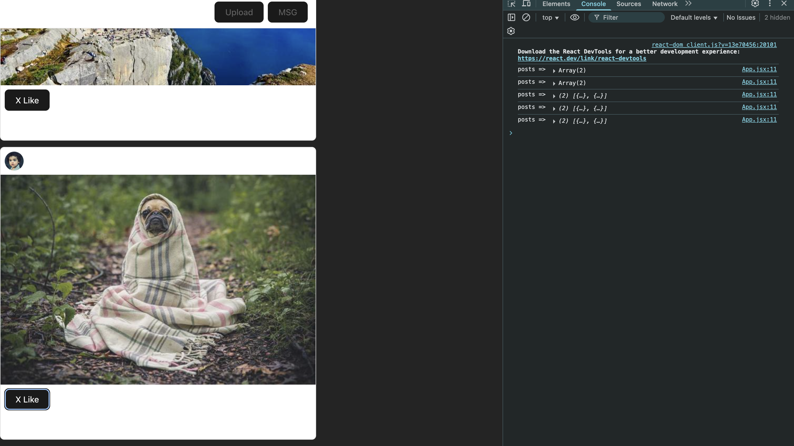
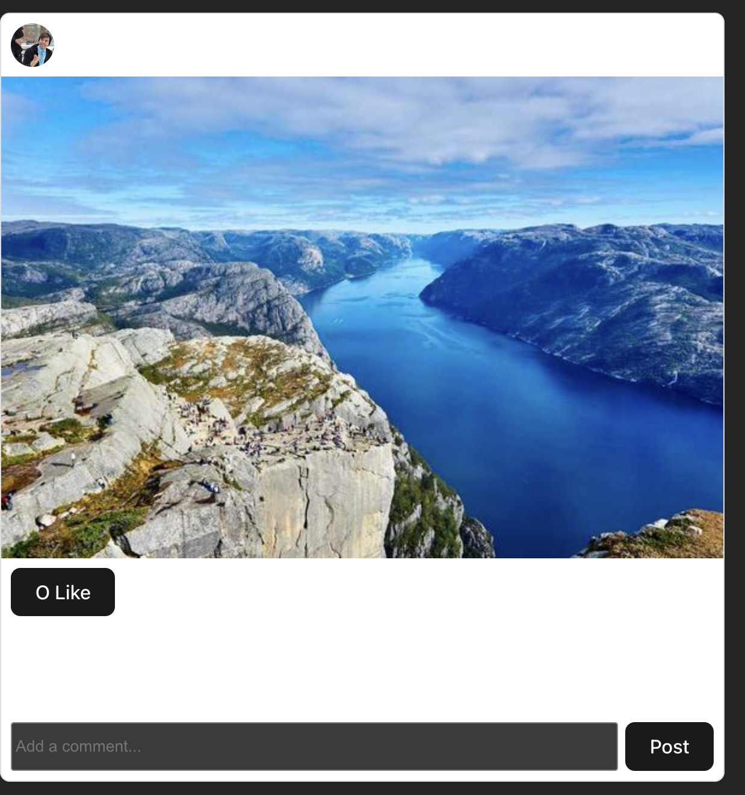

# Lab 2: Mini-Instagram App with React 18

This repository contains a fully functional Mini-Instagram application built with React 18, demonstrating modern React patterns, state management, routing, and accessibility features.

## 🚀 Features

- **Interactive Feed**: Posts with images, captions, likes, and comments
- **User Profiles**: Individual profile pages with routing (`/u/username`)
- **Post Creation**: Composer for creating new posts
- **Real-time Updates**: Likes and comments update instantly
- **Responsive Design**: Clean, mobile-friendly interface
- **Accessibility**: Screen reader support, keyboard navigation, ARIA attributes

## 🛠️ Tech Stack

- **React 18** with modern hooks and patterns
- **Vite** for fast development and building
- **React Router** for client-side routing
- **CSS3** with system fonts and responsive design

## 📱 Screenshots

### Part 0: Initial Setup

*Default Vite + React starter page*

### Part 3: PostCard Component

*PostCard component with like functionality and console logs*

### Part 3: Checkpoint Verification

*Verification of PostCard functionality with two posts and clean console*

### Part 4: Comments Functionality

*Comments system with existing and new comments*

### Part 5: Composer + New Post

*Post creation form and newly created post at top of feed*

### Part 6: Routing - Profile Page

*User profile page showing filtered posts for @bob*

### Polish: Final App with All Features

*Complete Mini-Instagram app with all features implemented*

## 🏗️ Project Structure

```
src/
├── components/
│   ├── CommentForm.jsx    # Form for adding comments
│   ├── CommentList.jsx    # Display list of comments
│   ├── Composer.jsx       # Form for creating new posts
│   ├── Feed.jsx          # Container for PostCard components
│   ├── Navbar.jsx        # Navigation header
│   ├── PostCard.jsx      # Individual post display
│   └── Profile.jsx       # User profile page
├── data/
│   └── posts.js          # Seed data for posts
├── App.jsx               # Main app component with routing
├── main.jsx             # App entry point
└── index.css            # Global styles
```

## 🚀 Getting Started

### Prerequisites
- Node.js (v18 or higher)
- npm or yarn

### Installation

1. Clone the repository:
```bash
git clone https://github.com/yourusername/lab-2.git
cd lab-2
```

2. Install dependencies:
```bash
npm install
```

3. Start the development server:
```bash
npm run dev
```

4. Open your browser to `http://localhost:5173`

### Build for Production

```bash
npm run build
npm run preview
```

## 📋 Lab Parts Completed

- ✅ **Part 0**: Project setup with Vite + React 18
- ✅ **Part 1**: Data model with seed posts
- ✅ **Part 2**: App state management and Feed component
- ✅ **Part 3**: PostCard component with like functionality
- ✅ **Part 4**: Comments system (CommentList + CommentForm)
- ✅ **Part 5**: Composer for creating new posts
- ✅ **Part 6**: Client-side routing with React Router
- ✅ **Polish**: Styling, accessibility, and user experience

## 🎯 Key Features Implemented

### State Management
- Functional state updates with `useState`
- Unidirectional data flow
- Immutable state updates

### Component Architecture
- Reusable, composable components
- Proper prop passing and lifting state up
- Clean separation of concerns

### Routing
- Client-side routing with React Router
- Dynamic routes (`/u/:handle`)
- Deep linking and browser navigation

### Accessibility
- ARIA attributes for screen readers
- Keyboard navigation support
- Semantic HTML structure
- Meaningful alt text for images

### Styling
- System font stack for native feel
- Responsive design with CSS Grid/Flexbox
- Hover states and visual feedback
- Dark/light theme support

## 🧪 Testing

The app has been tested for:
- ✅ Like functionality across multiple posts
- ✅ Comment addition and display
- ✅ Post creation with Composer
- ✅ Navigation between home and profile pages
- ✅ Deep linking with direct URLs
- ✅ Browser back/forward navigation
- ✅ Keyboard accessibility
- ✅ Screen reader compatibility

## 📝 Notes

This project was built as part of a React lab assignment, demonstrating:
- Modern React patterns and best practices
- Component-based architecture
- State management strategies
- Client-side routing implementation
- Accessibility considerations
- Professional development workflow

## 🤝 Contributing

This is a lab project, but feel free to fork and experiment with additional features!

## 📄 License

This project is for educational purposes.