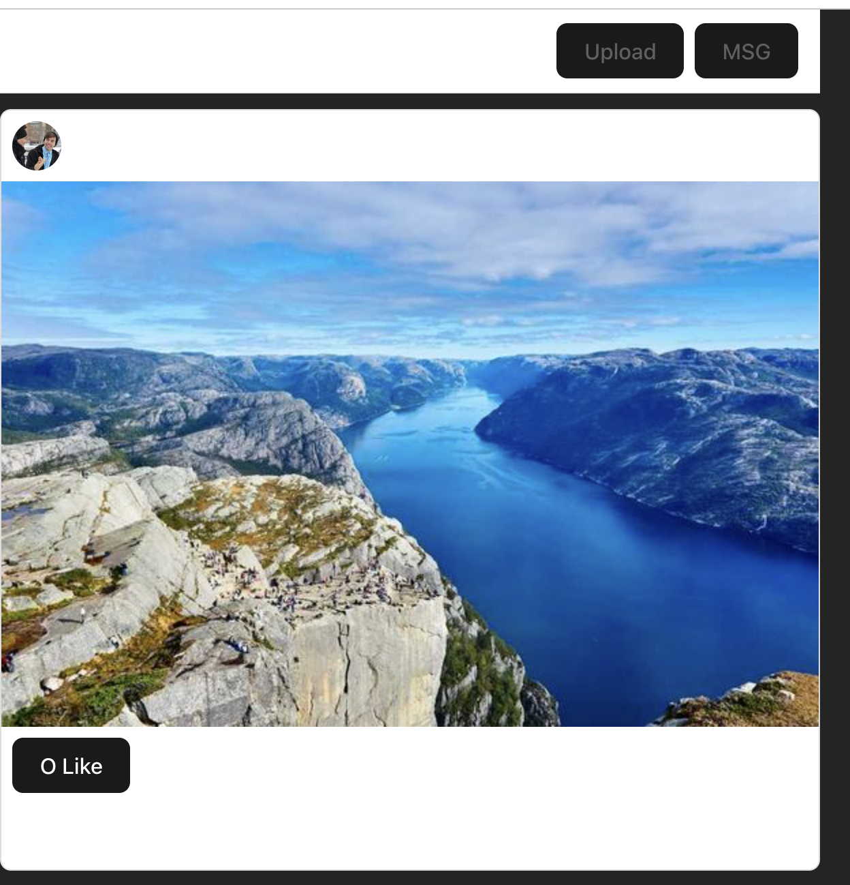
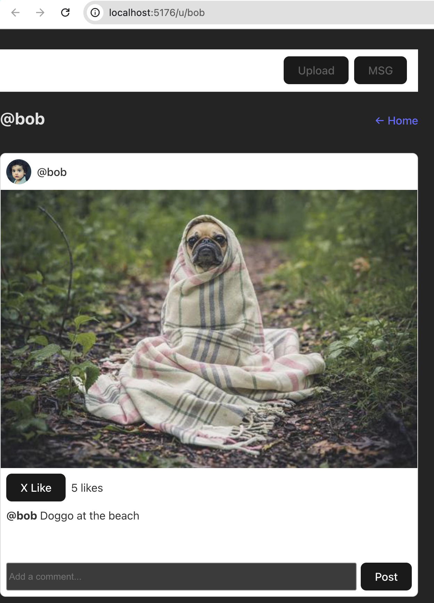

# Lab 2: Mini-Instagram App with React 18

A fully functional Mini-Instagram application built with React 18, demonstrating modern React patterns, state management, routing, and accessibility features.

## Features

- Interactive posts with likes and comments
- User profile pages with routing (`/u/username`)
- Post creation with Composer
- Real-time state updates
- Responsive design with accessibility features

## Tech Stack

- React 18 with hooks
- Vite for development
- React Router for client-side routing
- CSS3 with system fonts

## Getting Started

```bash
npm install
npm run dev
```

Open `http://localhost:5173` to view the app.

## Lab Parts Completed

- ✅ **Part 0**: Project setup with Vite + React 18
- ✅ **Part 1**: Data model with seed posts  
- ✅ **Part 2**: App state management and Feed component
- ✅ **Part 3**: PostCard component with like functionality
- ✅ **Part 4**: Comments system (CommentList + CommentForm)
- ✅ **Part 5**: Composer for creating new posts
- ✅ **Part 6**: Client-side routing with React Router
- ✅ **Polish**: Styling, accessibility, and user experience

## Screenshots

### Initial Setup (Part 0)


### PostCard Implementation (Part 3)


### Comments System (Part 4)


### Final App (All Features)


## Project Structure

```
src/
├── components/     # React components
├── data/          # Seed data
├── App.jsx        # Main app with routing
├── main.jsx       # Entry point
└── index.css      # Global styles
```